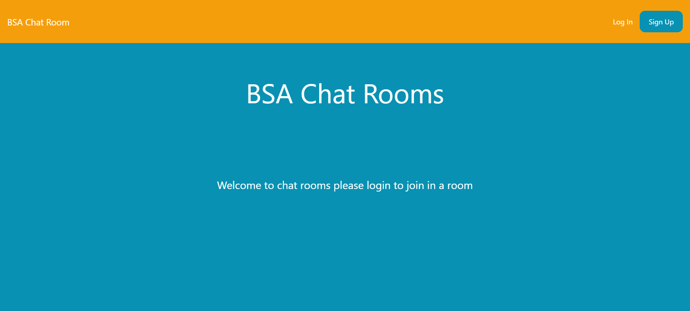
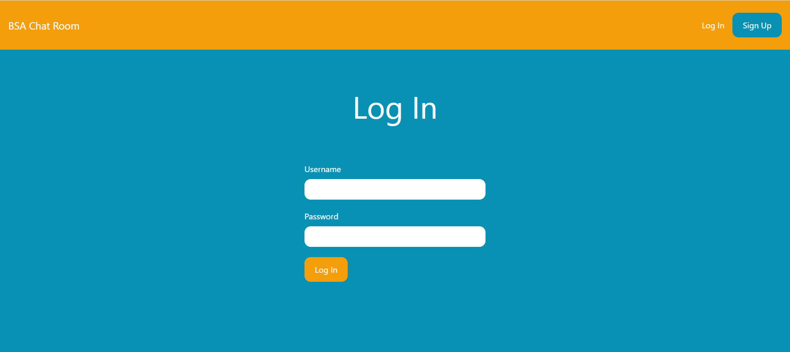
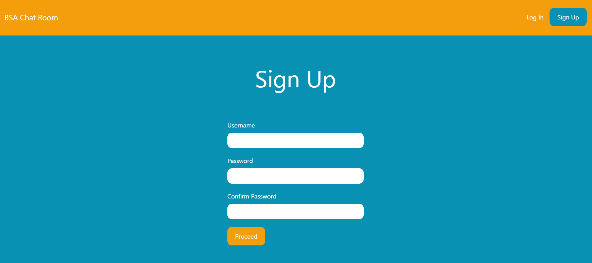
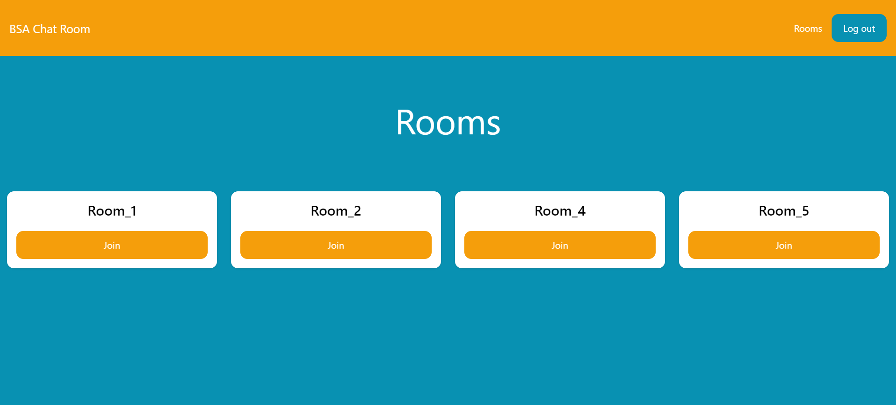
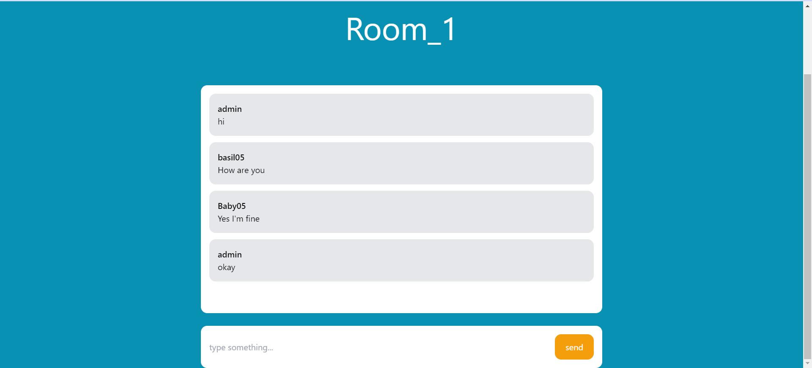

# Chat Rooms App:
This is a chat room app built in django using channels and daphne and websockets

User are first need to signup if they don't have an account, after creating the account they can join in a room and chat with others....and existing user can login whenever they want and join existing chatroom
and since created with tailwind the ui is flexible across different devices

# Output:

